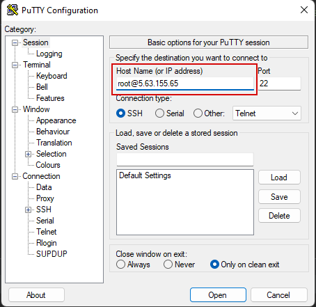

Подключение к виртуальной машине
==============================

SSH (**S**\ecure **Sh**\ell — «безопасная оболочка») — сетевой протокол прикладного уровня,
позволяющий производить удалённое управление операционной системой.

В nix подобных системах клиент обычно встроен, нужно открыть терминал и ввести команду
со следующим синтаксисом

.. code-block:: bash

    ssh remote_username@remote_host

В моем случае это

.. code-block:: bash

    ssh root@5.63.155.65

В windows нужно обычно используется PyTTY https://www.chiark.greenend.org.uk/~sgtatham/putty/latest.html
Нужно скачать putty-64bit-[version]-installer.msi и установить его.

Открыть клиент и в поле Host name ввести адрес подключения

При первом подключении к удаленному серверу будет запрос о доверии к сертификату сервера,
подтверждаем что доверяем.

В случае nix

В случае windows

В окне видим запрос пароля, вводим его (самого факта ввода пароля консоль не показывает).
При успешной аутентификаци будет отображена  консоль удаленного сервера