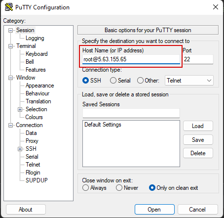

Основные Unix команды
=====================

Подключение к серверу через ssh
-------------------------------

SSH (**S**\ecure **Sh**\ell — «безопасная оболочка») — сетевой протокол прикладного уровня,
позволяющий производить удалённое управление операционной системой.

В nix подобных системах клиент обычно встроен, нужно открыть терминал и ввести команду
со следующим синтаксисом

.. code-block:: bash

    ssh remote_username@remote_host

В моем случае это

.. code-block:: bash

    ssh root@5.63.155.65

В windows нужно обычно используется PyTTY https://www.chiark.greenend.org.uk/~sgtatham/putty/latest.html
Нужно скачать putty-64bit-[version]-installer.msi и установить его.

Открыть клиент и в поле Host name ввести адрес подключения

При первом подключении к удаленному серверу будет запрос о доверии к сертификату сервера,
подтверждаем что доверяем.

В случае nix

В случае windows

В окне видим запрос пароля, вводим его (самого факта ввода пароля консоль не показывает).
При успешной аутентификаци будет отображена  консоль удаленного сервера

Просмотр содержимого текущей папки
----------------------------------

Команда `ls`, сокращенно от list - отображает директории и файлы вокруг вас. То есть в той папке, где вы находитесь на
текущий момент.
`ls –l` – показывает дополнительную информацию по содержимому папки
`ls –a` – показывает скрытые файлы в папке.

Поэтому чтобы сразу выводить полное содержимое папки указываем команду:
ls –la

Более подробная информация https://losst.pro/komanda-ls-linux

Перемещение по файловой системе
-------------------------------

Команда `cd`, сокращенно от change-directory (сменить каталог).

`cd ..` - перемещает на уровень выше в файловой системе от текущего расположения.

`cd имя_каталога` - перемещает в указанный каталог, находящийся в текущем каталоге.

# Выполнив команду ls –la мы по содержимому текущей папки убеждаемся, что перешли в нужный каталог

Более подробная информация в https://losst.pro/komanda-cd-linux